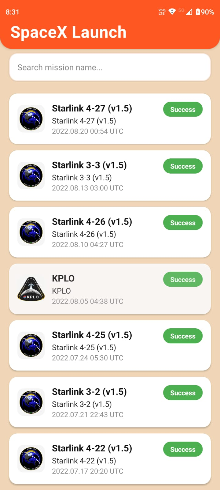
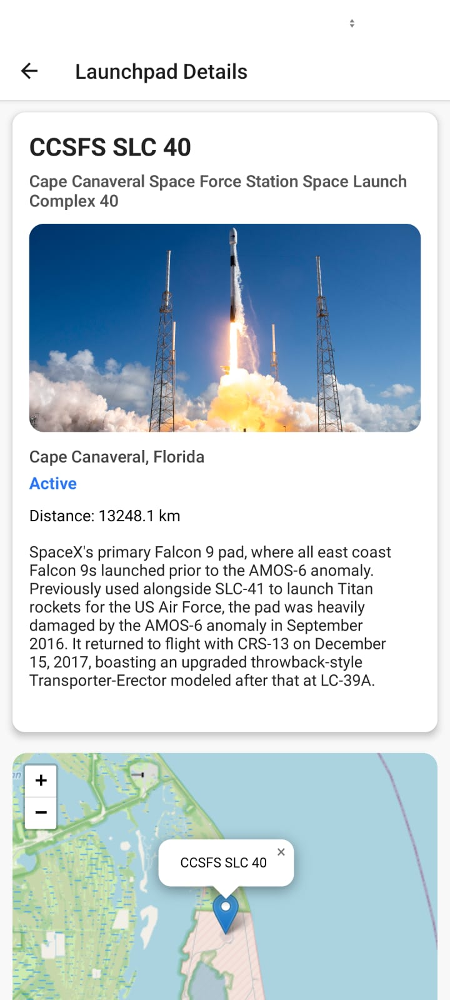

# SpaceX Launch Explorer

A React Native app built with Expo SDK 54 for exploring SpaceX launches and launchpads, featuring a maps-first native experience.

---

## Map Implementation and Libraries Used

- The map is embedded inside a **WebView** displaying an **OpenStreetMap** map powered by **Leaflet.js**.
- This approach avoids native dependency complications and supports Expo's managed workflow.
- Launchpads are marked with a default blue marker; the user's current location is marked with a custom green marker.
- Directions are opened in the device's native maps app (Apple Maps or Google Maps) using deep linking.
- Map tiles are fetched from the OpenStreetMap servers.

---

## Permission Flows and Handling

- The app requests **foreground location permissions** using the `expo-location` package when the launch details screen loads.
- Handles location permission denial gracefully with notification prompts.
- User location is retrieved and shown on the map.
- If location or distance cannot be determined, a toast or alert message notifies the user.
- The app only requests necessary permissions to operate and respects user privacy.

---

## App Screenshots

### Launch List Screen


### Launch Details Screen with Map


---

## Getting Started

Install dependencies and start the development server:

```bash
npm install
```

---

### Run the app with Expo Go

Start the development server:

```bash
npx expo start
```

- Scan the QR code in Expo Dev Tools using the Expo Go app on your device.
- Alternatively, use iOS Simulator or Android Emulator launched via Expo Dev Tools.

---

### Run on Android device or emulator (build and install)

```bash
npx expo prebuild
npx expo run:android
```

---

### Run on iOS Simulator (macOS only)

```bash
npx expo prebuild
npx expo run:ios
```

---

## Project Structure Highlights

- `screens/` - Screen components for list, details, and maps.
- `components/` - Reusable UI components such as launch list items.
- `services/spacexApi.ts` - RTK Query API slice for fetching SpaceX data.
- `common/useCommonFunctions.ts` - Utility functions including distance calculation.
- `navigation/` - Navigation stack and screen declarations.

---

## Contributing

Contributions to enhance features, fix bugs, or improve code quality are welcome. Please follow standard GitHub PR and issue workflows.

---

*This README will be updated with screenshots and additional information as the project evolves.*
